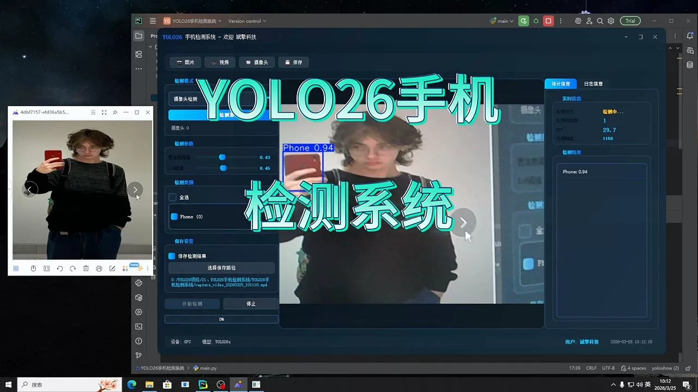
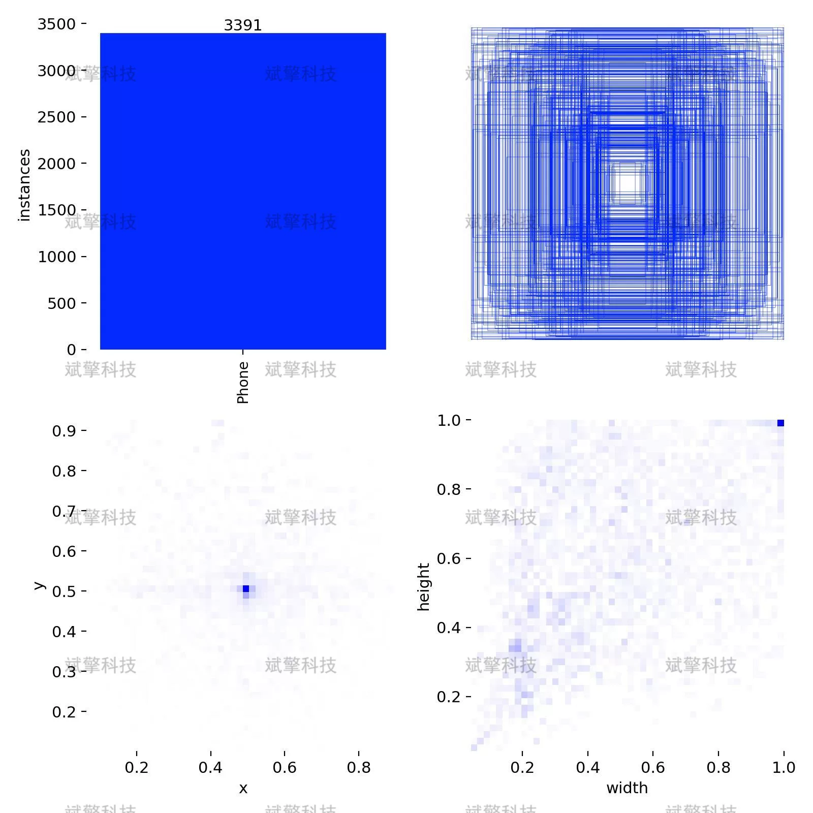
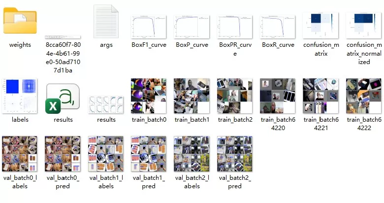
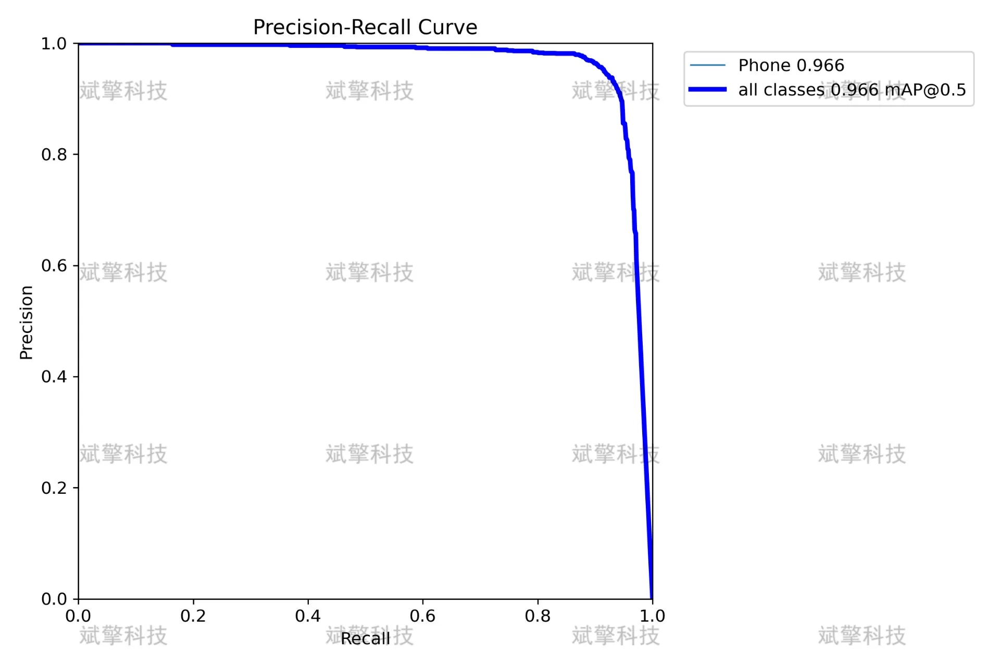
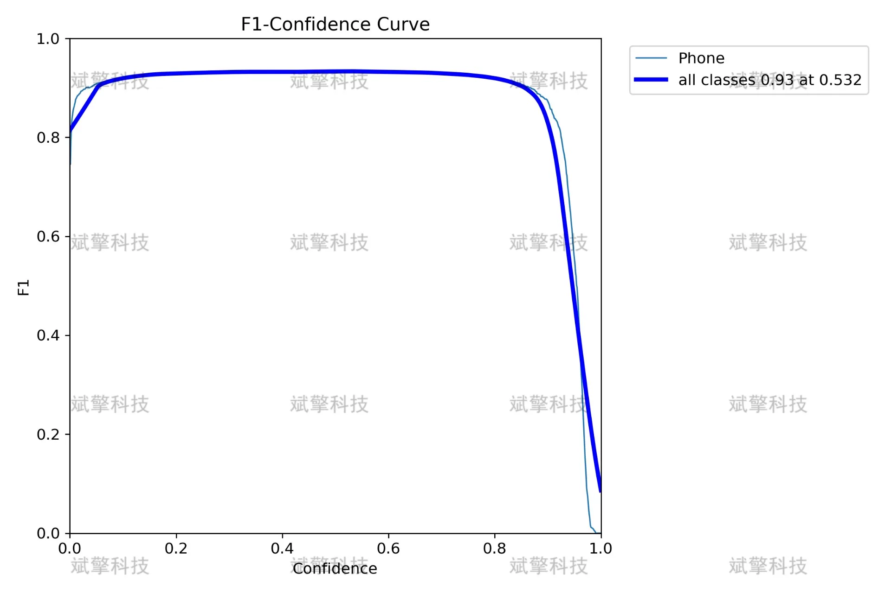
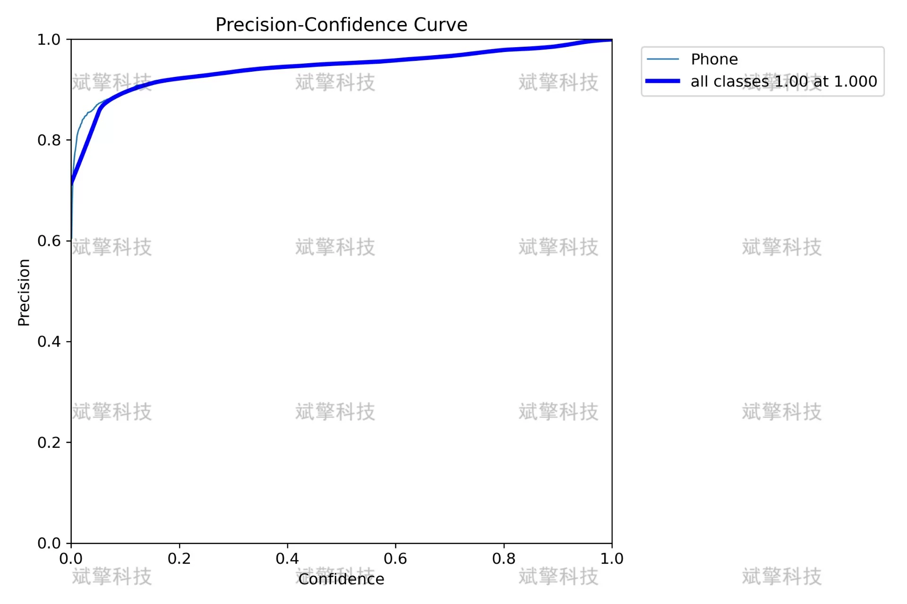
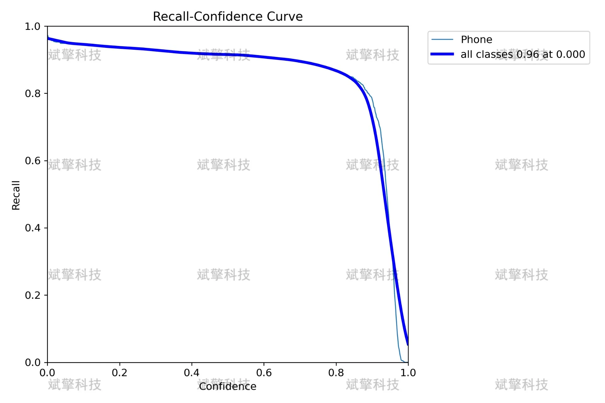
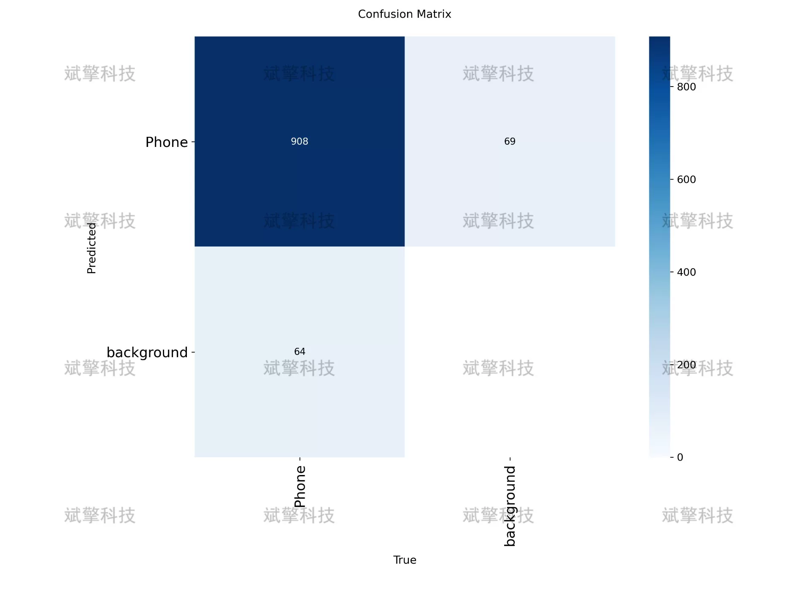
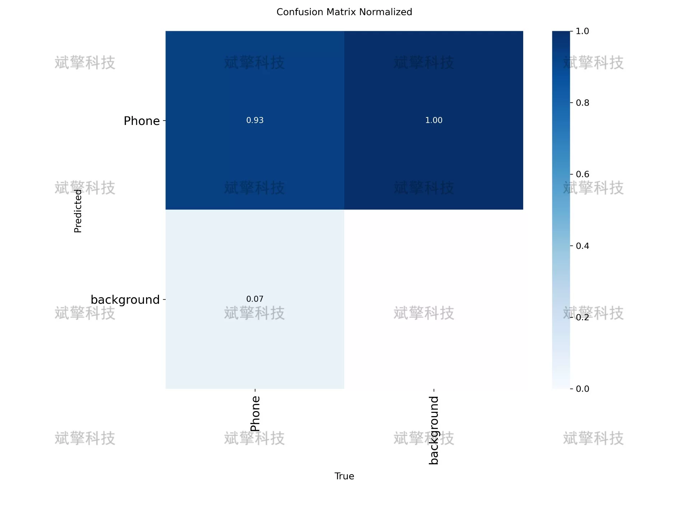

# YOLOv26 Mobile Detection System | Source Code + Dataset

## Body

YOLO26 Mobile Detection System | Source Code + Dataset: New SOTA for Mobile Object Detection? YOLOv26 runs on 3500 images to achieve an mAP of 96.6% with a dataset construction, model training, and deployment process

This report is based on the YOLO26 object detection algorithm and has developed a smart detection system for mobile objects. The system adopts a single-class object detection architecture and is trained and validated on our own mobile dataset.
The dataset consists of 3500 labeled images, including 2700 training images and 800 validation images. After thorough training, the model achieved excellent detection performance on the validation set: mAP50 reached 0.966, mAP50-95 was 0.818, precision was 0.953, recall was 0.916. A confusion matrix analysis showed that the model's accuracy in recognizing mobile phones reached 93%, with a false positive rate of only 7%.
Experimental results indicate that this model has high detection accuracy and robustness, meeting the detection needs of mobile objects in actual application scenarios.
Data partitioning strategy
The data is randomly divided into training sets and validation sets at a ratio of approximately 77%:23%:
Training set (2700 images): Used for learning model parameters
Validation set (800 images): Used for evaluating model performance and tuning hyperparameters

Free reservation for remote installation. Unsuccessful refund guaranteed.
Purchase includes the following resources (auto unlocked in Baidu Cloud):
- YOLO recognition detection project complete source code
- YOLO format dataset
- Training code + UI interface code
- Trained model + result images
- Software installation package
- Add WeChat to make a reservation for remote installation (automatically display WeChat ID after purchase) - Unsuccessful refund guaranteed

⚙️ Core function modules
Detection capabilities
- Image detection: upload and detect, returning detection boxes + category information
- Video detection: supports video files, analyzing frames accurately
- Camera real-time detection: connect USB cameras to achieve dynamic monitoring
Interaction and control
- Target selection: freely choose one or more categories for detection
- Parameter adjustment: adjustable confidence threshold & IoU threshold, flexibly controlling precision
- Results saving: one-click save of image/video/camera detection results
System and data
- User login registration: Supports password strength checking + encryption storage
- Log recording: automatically records operation and error information (timestamped)

## Images

## Payment

Here is a pay link on Stripe ( https://buy.stripe.com/3cs8yP7sY87d0vu9AB ). Please contact me lonlonago@foxmail.com after funding $89, and I will send you a complete data files , thank you!

